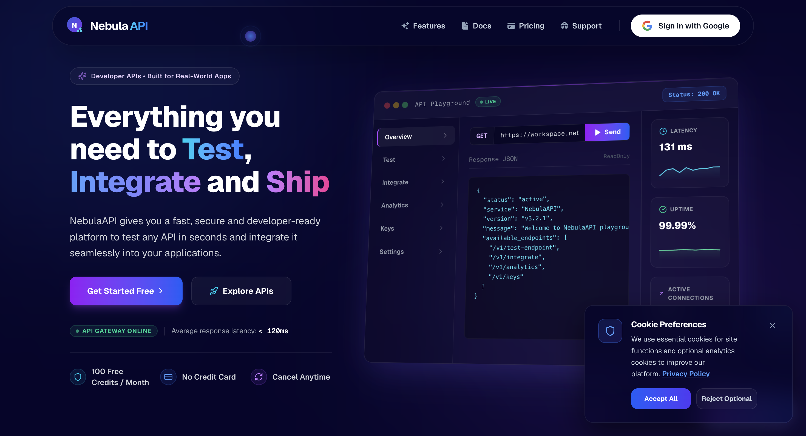
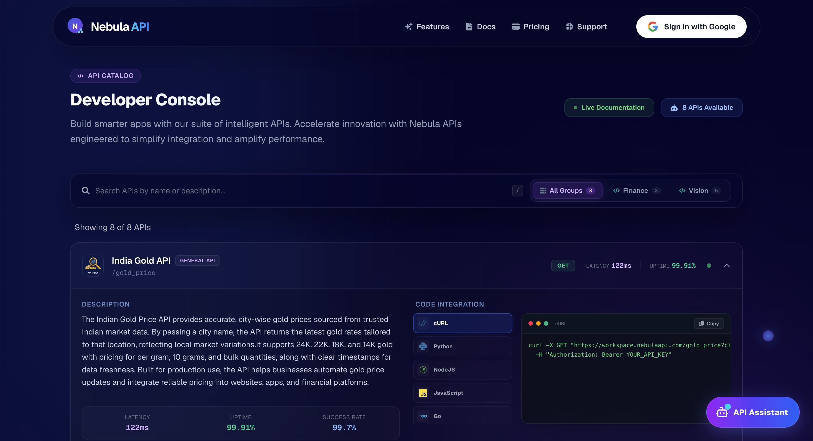
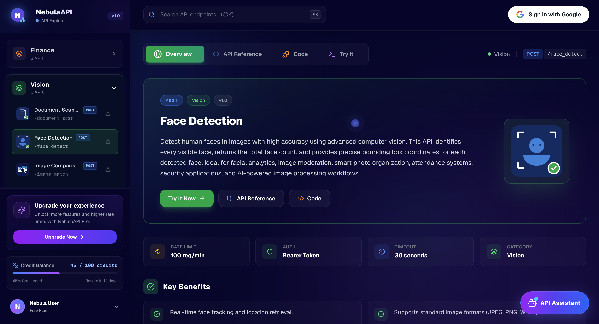
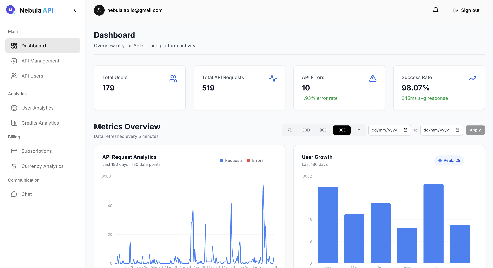
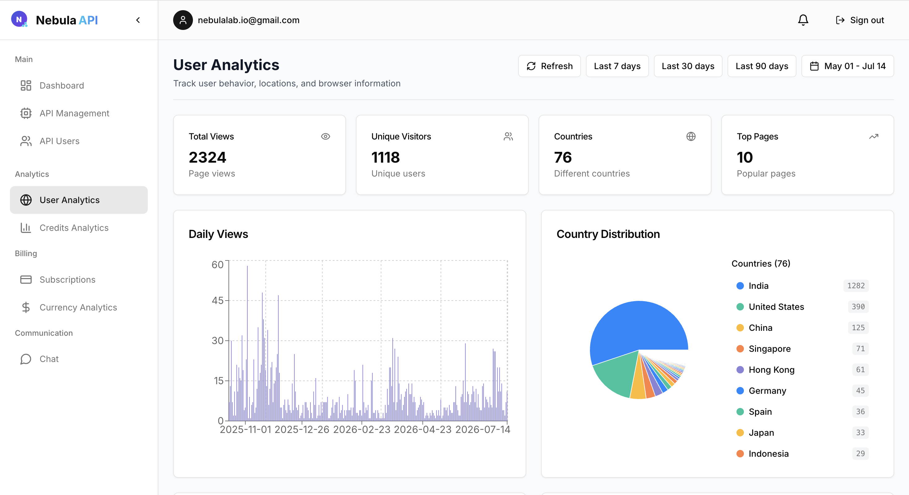

# NebulaAPI Showcase

A public showcase of NebulaAPI — a SaaS platform designed, developed, and maintained by me as an independent side project.

NebulaAPI was built from scratch to provide developers and businesses with APIs, developer tools, analytics, and platform services through a single ecosystem.

> ⚠️ The production source code is maintained in private repositories. This repository exists to showcase the platform architecture, product capabilities, and engineering decisions behind NebulaAPI.

---

## Live Product

🌐 Product Website:
https://www.nebulaapi.com

👨‍💻 Portfolio:
https://www.nebulaapi.com/portfolio

---

## Product Highlights

- Developer API Platform
- Subscription and Payment Management
- Custom Analytics Dashboard
- Internal CMS and Admin Panel
- Real-time User Activity Tracking
- Global Usage Monitoring
- Real-time Chat Module
- API Key Management
- Usage and Credit Tracking
- Developer Tools and Utilities
- Responsive Web Application

---

## Tech Stack

### Frontend
- React
- TypeScript
- Tailwind CSS
- React Query

### Backend
- Node.js
- Express.js
- MongoDB
- JWT Authentication

### Infrastructure
- Docker
- Cloud Deployment
- CI/CD Pipelines

---

## My Responsibilities

As the sole developer of NebulaAPI, I was responsible for:

- Product Architecture
- UI/UX Development
- Backend Development
- Database Design
- Authentication & Authorization
- Payment Integration
- Analytics Implementation
- CMS Development
- Deployment & DevOps
- Monitoring & Maintenance

---

## Product Metrics

- 170+ Registered Users
- Global User Base
- Multiple Production Services
- Growing Developer Community

---

## Screenshots

---

## Why This Repository Exists

This repository is intended to showcase:

- Product Architecture
- Engineering Decisions
- Feature Design
- Technical Ownership
- System Thinking

The production implementation remains private while this repository provides visibility into the engineering effort behind the platform.
